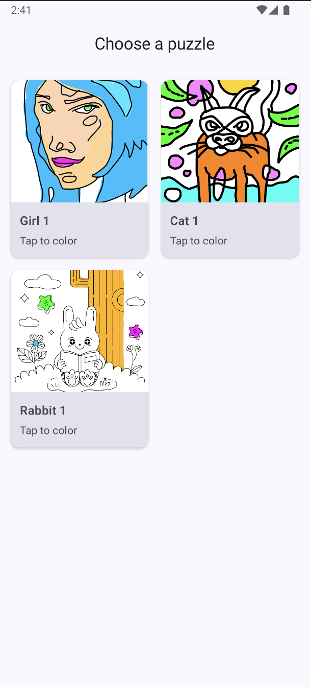
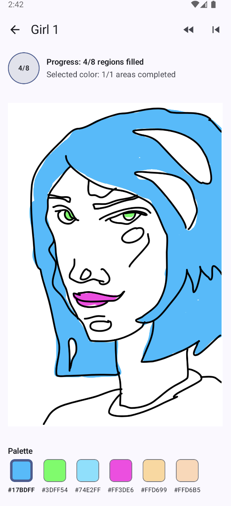
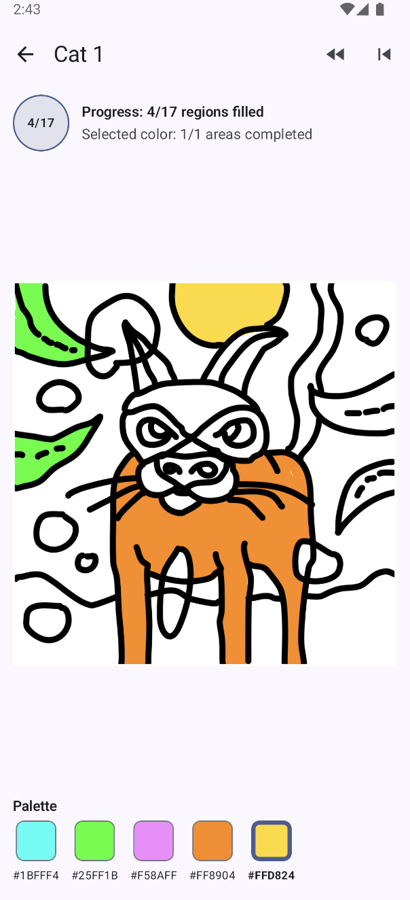

# Color By Number

An Android color-by-number app built with Jetpack Compose. Pick a puzzle from the home grid, choose a color from the palette, and tap matching regions to fill them in.

## Screenshots

| Home | Girl 1 | Cat 1 |
| --- | --- | --- |
|  |  |  |

## Features

- Puzzle grid with preview thumbnails
- Tap-to-fill coloring with palette selection
- Progress tracking per puzzle and per selected color
- Pinch-to-zoom and pan on the coloring canvas
- Undo last fill and clear all fills
- SVG-based puzzles with separate line and color layers

## How it works

### Puzzle assets

Each puzzle lives under `app/src/main/assets/imagedata/<puzzle-id>/` and typically contains:

- `colors_<id>.svg` — filled color regions used for gameplay and region detection
- `lines_<id>.svg` — black outline layer drawn on top of the fill
- `preview_<id>.png` (optional) — thumbnail for the home grid

The catalog in `app/src/main/assets/puzzlelist.json` maps puzzle IDs to display names and asset folders.

### Loading and region detection

When a puzzle opens, `SvgPuzzleAssetLoader`:

1. Renders the colors SVG to a bitmap (using [AndroidSVG](https://bigbadaboom.github.io/androidsvg/)).
2. Renders the lines SVG to a matching-size bitmap.
3. Scans the color bitmap pixel by pixel and groups connected pixels of the same color into regions via flood fill.
4. Builds the palette from colors declared in the SVG (`fill` / `stroke` attributes). Regions whose color appears in the palette and is large enough (≥ 64 pixels) become playable fill targets.

The result is an `SvgPuzzle` with:

- A per-pixel `regionLabels` map for fast hit testing
- A list of `SvgRegion` entries with target color and palette ID
- Separate bitmaps for fills and outlines

### Rendering

The canvas draws two layers each frame:

1. **Fill layer** — `SvgPuzzle.composeDisplayBitmap()` builds a bitmap from the region map:
   - Unfilled playable regions are white
   - Regions matching the currently selected palette color show a checkerboard hint
   - Filled regions show their target color
   - Small non-playable slivers next to filled regions inherit the neighbor color so gaps do not show through
2. **Line layer** — the outline bitmap is drawn on top with anti-aliasing

The view supports pinch-to-zoom (1×–6×) and pan, with screen/world coordinate transforms for tap handling.

### Color application

Gameplay state is held in a `PuzzleSession`:

- `selectedPaletteId` — the active palette swatch
- `fillsByRegionId` — map of region ID → applied palette color ID
- `fillHistory` — stack for undo

When the user taps the canvas:

1. The tap is converted from screen space to puzzle pixel coordinates.
2. `SvgPuzzle.regionAt(x, y)` looks up the region at that pixel.
3. A fill is applied only if the region is playable, matches the selected palette color, and is not already filled.

Progress counters show total regions filled and how many regions remain for the selected color.

## Tech stack

- Kotlin
- Jetpack Compose + Material 3
- AndroidSVG for SVG rendering
- Gson for JSON parsing
- Min SDK 24, target SDK 35

## Project structure

```
app/src/main/
├── assets/
│   ├── imagedata/       # SVG puzzle assets (colors + lines per puzzle)
│   └── puzzlelist.json  # Puzzle catalog
└── java/network/bahn/colorbynumber/android/
    ├── MainActivity.kt           # Puzzle grid
    ├── ColoringActivity.kt       # Coloring UI and canvas
    ├── PuzzleCatalog.kt          # Loads puzzle list from assets
    └── coloring/
        ├── SvgPuzzleAssetLoader.kt  # SVG load, region analysis, rendering
        ├── PuzzleTopology.kt        # Topology helpers (legacy .cbn format)
        ├── PuzzleJsonParser.kt      # .cbn / .cbnpalette parser
        └── PuzzleProgressStore.kt   # Progress persistence helpers
```

## Getting started

### Prerequisites

- Android Studio (Ladybug or newer recommended)
- JDK 11+
- Android SDK 35

### Run

1. Clone the repository.
2. Open the project in Android Studio.
3. Sync Gradle and run the `app` configuration on an emulator or device.

### Tests

```bash
./gradlew test
```

## License

This project is licensed under the MIT License — see [LICENSE](LICENSE).
